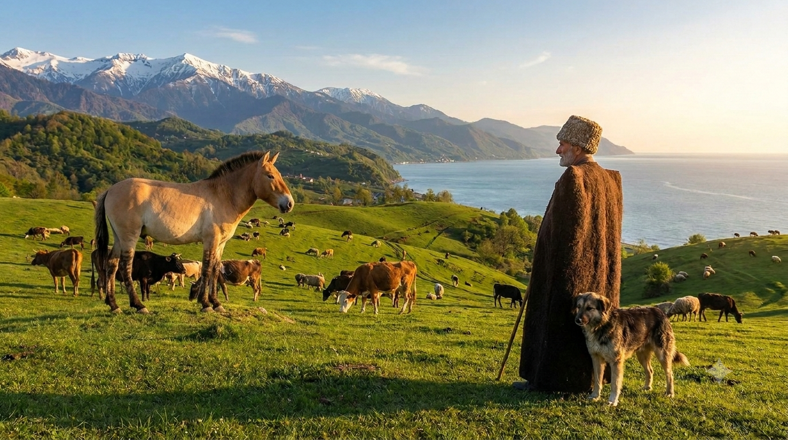
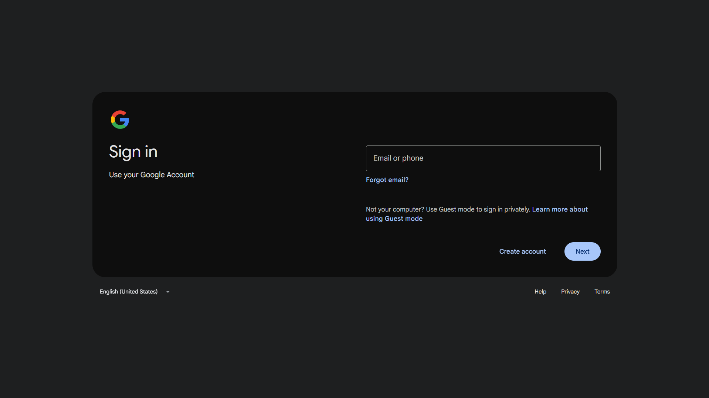
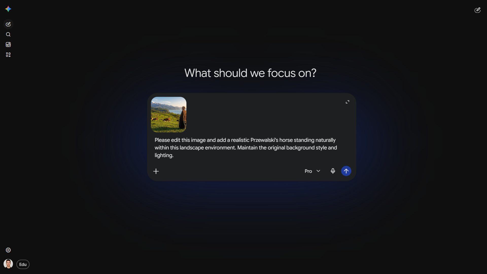
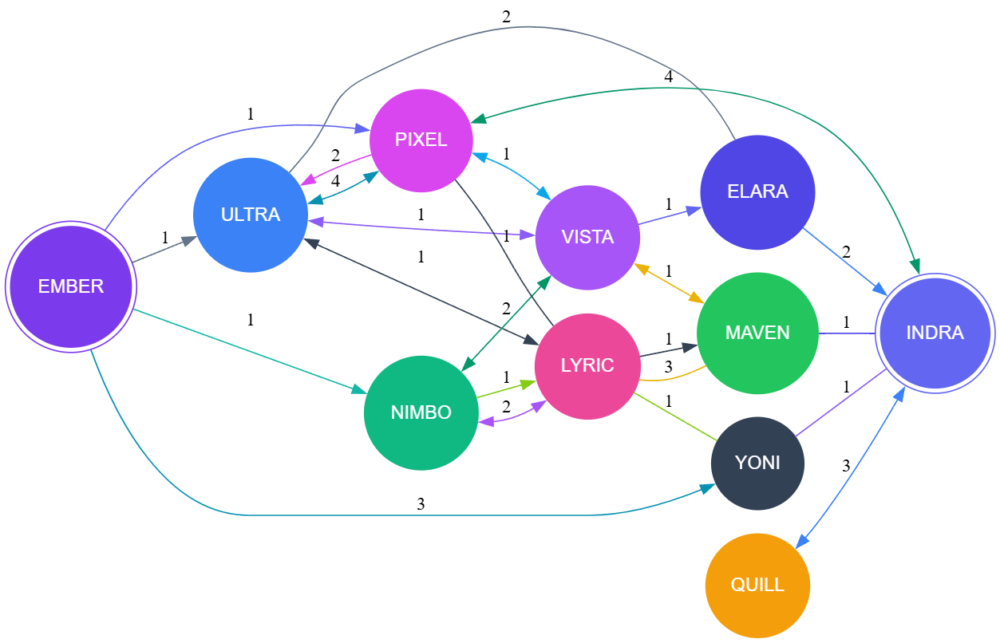

## Task 1. Using Generative AI

---

## Task 2. User Manual: Adding a Przewalski Horse using Google Gemini

This user manual provides a step-by-step guide on how to set up an account with Google Gemini, upload a template landscape image, and use generative AI to add a Przewalski's Horse into the scene.

### Step 1: Accessing and Signing Up for Gemini

1. Open your web browser and navigate to [gemini.google.com](https://gemini.google.com).
2. Click on the **Sign in** or **Chat with Gemini** button.
3. Log in using your existing Google Account, or click **Create account** if you do not have one.
4. Follow the on-screen prompts to accept the Terms of Service and complete the setup.

---

### Step 2: Preparing the Initial Picture

1. Navigate to the source URL: `https://max.ge/ai2026/final/picture-template.jpeg`.
2. Right-click on the image and select **Save Image As...**.
3. Save the image to your local workspace as `initial-picture.jpeg`.

#### Initial Template Picture:

---

### Step 3: Uploading the Image and Prompting Gemini

1. Return to your active Gemini chat interface.
2. Click on the **+** (Plus/Upload) icon located in the text prompt bar at the bottom of the screen.
3. Select your saved `initial-picture.jpeg` file to upload it.
4. In the text field, type the modification prompt clearly. 
   > **Recommended Prompt:** *"Please edit this image and add a realistic Przewalski's horse standing naturally within this landscape environment. Maintain the original background style and lighting."*
5. Press **Enter** or click the send arrow to submit your request.

---

### Step 4: Reviewing and Saving the Final Result

1. Gemini will process the image and present the generated options.
2. Review the output variants to ensure the Przewalski's Horse blends realistically into the original environment.
3. Hover over your preferred version, click the **Download** (downward arrow) icon to save the final image.
4. Name the final image file `final-result.png` and save it to your project repository.

#### Final Result:

---

## Task 3. Finding the graph

